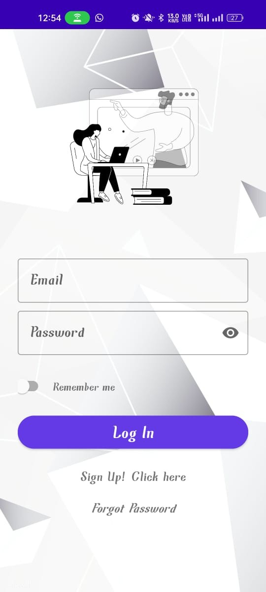
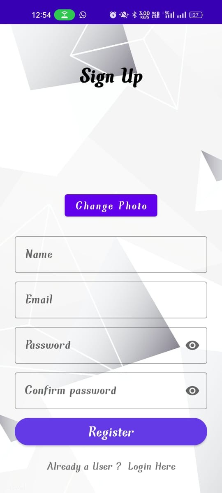
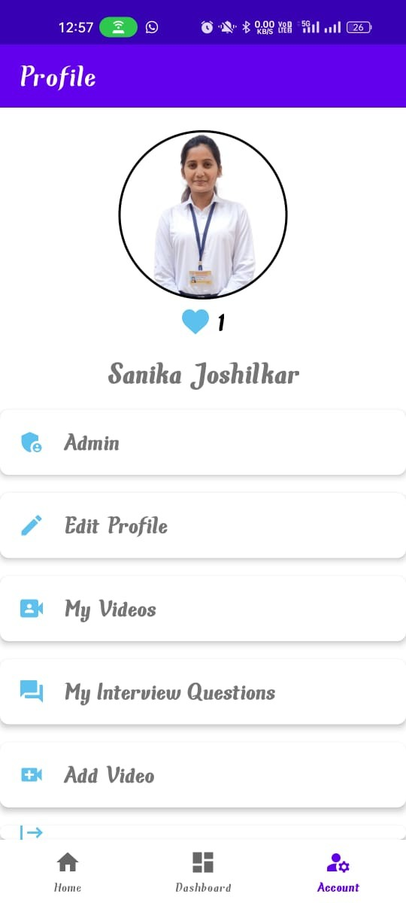
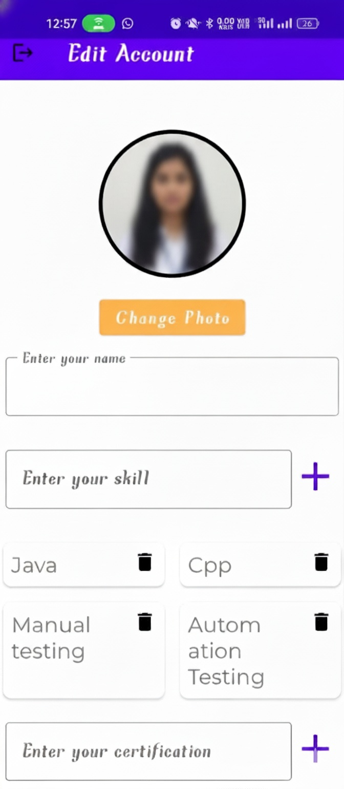
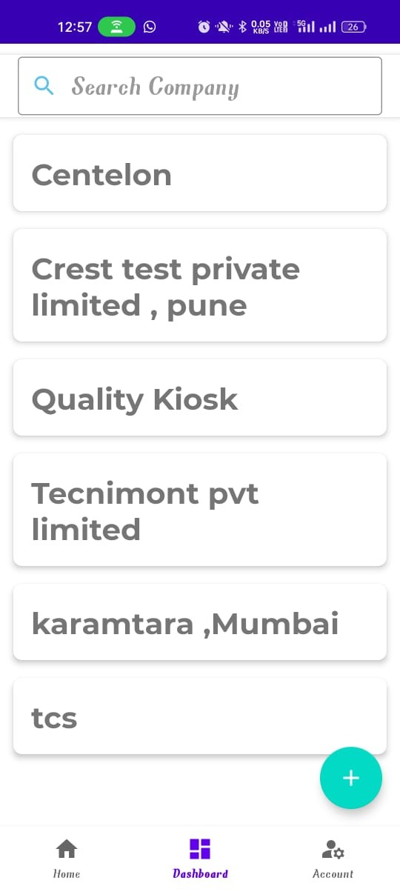
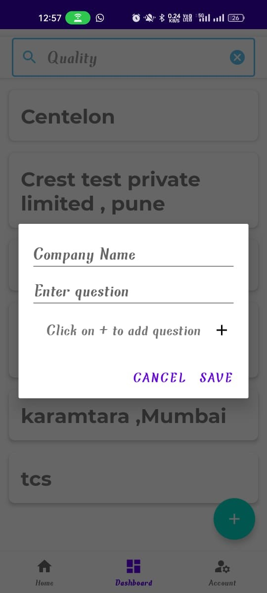
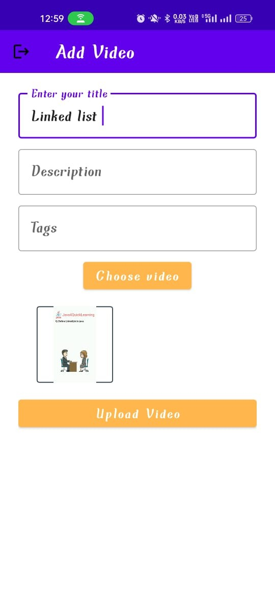

# 📱 EDUQuest – Android Learning & Interview Preparation App

EDUQuest is an Android application built using **Java & Firebase**, designed to help students prepare for interviews, share knowledge through videos, upload company-specific interview questions, and build their professional portfolios.

This app works as a **peer-learning platform**, enabling students to interact, share helpful content, and prepare for placements effectively.

---

# 🚀 Features

## 👤 User Authentication
- Login / Sign Up
- Firebase Authentication
- Remember Me feature
- Forgot Password

## 🧑‍🎓 User Profile
- Upload & edit profile photo
- Add skills dynamically
- Add certifications
- Display like count
- View all uploaded videos
- Edit personal information

## 🎥 Video Upload System
- Enter title, description & tags
- Select video from device
- Video thumbnail preview
- Upload to Firebase Storage
- Store metadata in Firebase Realtime Database
- Admin approval required for published content

## 🏢 Company Interview Questions
- Add company name
- Add multiple interview questions
- Display company list on dashboard
- Search company using TextInputLayout
- Filters & search suggestions

## ❤️ Likes & Comments
- Persistent like/unlike system
- Store like state in Firebase (“users” node)
- Shows like count under profile photo
- Add comments with username included
- Comments displayed in RecyclerView

## 🛠 Admin Panel
- View all uploaded videos
- Approve or reject videos
- Control platform content

---

# 🏗 Tech Stack

| Component | Technology |
|----------|------------|
| Language | Java |
| UI | XML, Material Design Components |
| Database | Firebase Realtime Database |
| Storage | Firebase Storage |
| Authentication | Firebase Auth |
| Architecture | MVVM |
| Libraries | Picasso, Lottie Animations, RecyclerView |

---

# 📸 App Screenshots

> Upload images to your GitHub `/images/` folder and replace the paths below.

### 🔐 Login

### 📝 Sign Up

### 👤 Profile

### ✏️ Edit Profile

### 🏢 Company Dashboard

### ➕ Add Company Questions

### 🎥 Add Video

---

# ✅ How to Run the Project

1. Clone the repository:
git clone https://github.com/yourusername/eduquest.git

yaml
Copy code

2. Open in **Android Studio**

3. Add your `google-services.json` into the `/app/` directory

4. Sync Gradle

5. Connect Firebase in Android Studio → Tools → Firebase

6. Run on emulator or physical device

